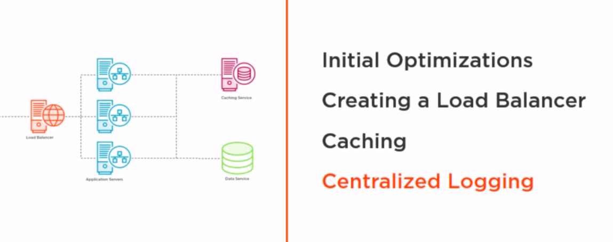

# load-balancer-demo





First we have TLS enabled for HTTPS and gzip HTTP2 headers

We introduced **load balancer** to make real horizontal scaling. The load balancer has probe to heartbeat particular appservers.
Particular appservers must register to loadbalancer and unregister. If it is not unregistered but doesnt leave, LB will unregister automatically.
Normally we must register appservers manually or via terraform. Or we must implement / hardcode  LB  discovery from app servers. 
In our case it is hardcoded but it could be part of configuration or injected by k8s webhook.
     

**Cache service** massively increase performance because each app server is round-robined 
and requests may repeat , so if one appserver populatres template and returns result, other appservers could share it.
For resources like .css styles, javascript, pics we dont use cache. In production those resources would sit in CDN which
 offers cache as well and it replicates resources around the globe 
 
 
**Log aggregator** sercvice is responsible for distributed logging into file. in production we should use database. 
    
 


### Running locally 

install certificate by default go tool `generate_cert.go`
```bash
go install $GOROOT/src/crypto/tls/generate_cert.go
./generate_cert -host localhost
cp -f  key.pem /etc/lb/certs/key.pem
cp -f  key.pem /etc/lb/certs/cert.pem
```